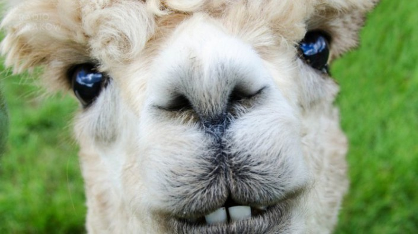

## Hodowla alpak

### Co to są alpaki

To słodkie zwierzątka. Jeśli chcesz zdobyć jedną, musisz dodać do swojego kodu

```markdown
Animal.add(alpaka);
```
inne przydatne polecenia:

```markdown
sell(alpaka);
feed(alpaka);
evolve(alpaka);
```

Więcej szczegółów [tu](https://google.com).


